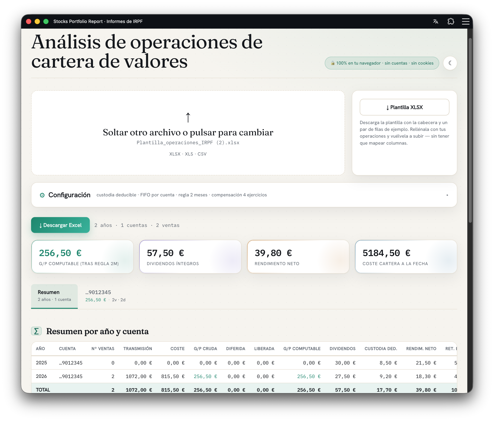

# Stocks Portfolio Report · Informes de IRPF de cartera

[](https://github.com/eaceto/stocks-portfolio-report/actions/workflows/ci.yml)
[](./LICENSE)
[](./packages/engine/tests)
[](https://nextjs.org)
[](https://web.dev/progressive-web-apps/)
[](https://vercel.com/new/clone?repository-url=https%3A%2F%2Fgithub.com%2Feaceto%2Fstocks-portfolio-report)

> 🌐 **Demo en producción**: <https://stocks-portfolio-spain.vercel.app/>

Aplicación web (PWA) que genera los informes necesarios para la **declaración de IRPF** a partir de un extracto de operaciones de una cartera de valores. Para **cada año** del archivo y **cada cuenta** calcula ventas con **FIFO** (ganancia/pérdida), dividendos, gastos de custodia y posiciones a la fecha, con la trazabilidad completa de cada venta (primera y última fecha de adquisición, nº de lotes consumidos), aplica la **regla de los 2 meses** (art. 33.5.f) y la **compensación de pérdidas entre ejercicios** (art. 49, hasta 4 años).



- 📄 Lógica de cálculo detallada: [`docs/LOGICA_DE_NEGOCIO.md`](./docs/LOGICA_DE_NEGOCIO.md)
- 🔐 Política de seguridad: [`SECURITY.md`](./SECURITY.md)
- ⚖️ Privacidad y aviso legal: [`/privacy`](./apps/web/src/app/privacy/page.tsx)
- 📊 Archivo de datos de ejemplo (para tests e2e): [`docs/test_data.xlsx`](./docs/test_data.xlsx)

---

## Privacidad

- **100% en el navegador.** El archivo nunca se sube a ningún servidor: se lee y procesa localmente (en un Web Worker, con _fallback_ al hilo principal).
- **Sin cuentas, sin cookies, sin seguimiento, sin historial.** Es un export estático: no hay backend que pueda ver los datos. Al recargar la página se borra todo.
- **Sin IA.** El cálculo es determinista (parseo + FIFO en TypeScript).

---

## Requisitos

- **Node.js 18.18+** (recomendado 20 o 22) y npm.

## Ejecutar en local

```bash
npm install
npm run dev          # desarrollo en http://localhost:3000
```

Compilar el export estático (desplegable en Vercel, Netlify, S3, GitHub Pages…):

```bash
npm run build        # genera apps/web/out con HTML/JS/CSS estáticos
npx serve apps/web/out   # servir el export (la PWA requiere http(s)/localhost, no file://)
```

Calidad:

```bash
npm test             # tests del motor (Vitest)
npm run coverage     # tests + cobertura
npm run typecheck    # comprobación de tipos (engine + web)
npm run verify:engine  # verifica el motor contra un archivo real (ver packages/engine/scripts/verify.ts)
```

CI (GitHub Actions, `.github/workflows/ci.yml`) corre `typecheck + test + coverage + build` en cada push/PR a `main`.

### Despliegue en Vercel

El repo está listo para Vercel: el `vercel.json` en la raíz configura el monorepo (build command + output directory). Basta con importar el repo en Vercel; no hace falta tocar la UI:

- **Install command**: `npm ci` (instala el workspace completo)
- **Build command**: `npm run build --workspace apps/web`
- **Output directory**: `apps/web/out` (export estático)

Vercel genera deployments de preview por PR y promueve a producción al hacer merge en `main`. Sin servidor: el HTML/JS/CSS es estático.

---

## Funcionamiento básico

1. **Sube** un archivo `.xlsx`, `.xls` o `.csv` con tus operaciones (arrástralo o haz clic). Si no tienes a mano, descarga la **plantilla XLSX** del botón al lado del dropzone (incluye una hoja Léeme).
2. Ajusta los **criterios fiscales** en el panel «Configuración» (4 toggles, colapsado por defecto):
   - **Gastos de custodia deducibles** (art. 26.1.a).
   - **FIFO por cuenta** vs **por titular (ISIN global)** (art. 37.2).
   - **Regla de los 2 meses** (art. 33.5.f) — defer + release.
   - **Compensación de pérdidas** entre ejercicios (art. 49, 4 años).
   Cambiar un toggle recalcula al instante; no hay que volver a subir el archivo.
3. Consulta los resultados en pantalla: KPIs, resumen por año/cuenta, detalle de ventas con trazabilidad FIFO, dividendos, custodia, posiciones, pérdidas diferidas pendientes, compensación de pérdidas y diagnóstico del parseo. Todas las secciones son colapsables.
4. Pulsa **«Descargar Excel»** para obtener el informe completo en `.xlsx`, con una hoja «Todas las ventas» chronológica + una hoja por cuenta.

### Formato de entrada esperado

Nombres de columna detectados de forma flexible (con/sin acentos); las opcionales pueden faltar. **Si la autodetección falla, la UI ofrece un mapeo manual** en el panel «Diagnóstico del parseo».

| Columna                 | Uso                                              | Obligatoria  |
| ----------------------- | ------------------------------------------------ | ------------ |
| Fecha                   | fecha de la operación (dd/mm/aaaa o serial Excel)| sí           |
| Contrato / Cuenta       | cuenta de custodia                               | sí           |
| Nombre producto / Valor | nombre + ISIN del valor                          | sí           |
| Tipo de operación       | compra / venta / dividendo / custodia / derechos | sí           |
| Títulos / Nominal       | nº de títulos (con signo)                        | compra/venta |
| Importe Neto            | flujo neto de caja (con signo)                   | sí           |
| Importe Gasto           | comisión de la operación                         | opcional     |
| Importe bruto origen    | dividendo íntegro                                | dividendos   |
| Retención origen        | retención en el extranjero                       | opcional     |
| Retención destino       | retención en España                              | opcional     |

El detector de cabecera ignora las filas de metadatos que algunos bancos colocan sobre la tabla.

---

## Estructura del monorepo

```
.
├── packages/
│   └── engine/                  @stocks-portfolio-irpf/engine (motor puro, sin UI ni red)
│       ├── src/
│       │   ├── parse.ts         XLS/XLSX/CSV → operaciones normalizadas
│       │   ├── dedup.ts         detección de duplicados / filas sospechosas
│       │   ├── fifo.ts          FIFO + regla 2 m + carryforward + ensamblado
│       │   ├── export-xlsx.ts   Excel descargable (con trazabilidad FIFO completa)
│       │   ├── template.ts      plantilla XLSX que el usuario puede descargar
│       │   ├── types.ts, index.ts
│       ├── tests/               101 tests (Vitest) — parse, FIFO, regla 2m, carryforward, dedup, e2e
│       └── scripts/verify.ts    Verificación contra un archivo real
├── apps/
│   └── web/                     @stocks-portfolio-irpf/web (Next.js PWA, export estático)
│       ├── src/
│       │   ├── app/             App Router (page.tsx, layout.tsx, privacy/, globals.css)
│       │   ├── components/      ResultsView, ThemeToggle, panels colapsables
│       │   ├── fonts/           woff2 autohospedados (sin Google Fonts en runtime)
│       │   ├── lib/format.ts    formatters es-ES (€, fechas)
│       │   └── worker/          Web Worker que ejecuta el motor
│       └── public/              iconos PWA + manifest + og.png + sw.js
├── docs/
│   ├── LOGICA_DE_NEGOCIO.md     Explicación completa del cálculo
│   ├── screenshot_tests.png     Captura del informe (usada en este README)
│   └── test_data.xlsx           Plantilla realista para tests e2e
├── .github/
│   ├── workflows/ci.yml         typecheck + test + coverage + build
│   ├── dependabot.yml           updates semanales agrupados
│   ├── ISSUE_TEMPLATE/          bug + feature + security/discussions links
│   └── pull_request_template.md
├── vercel.json                  config de despliegue (monorepo → apps/web)
├── SECURITY.md                  política de seguridad
└── LICENSE                      MIT
```

---

## Limitaciones

- **No es asesoramiento fiscal.** Es una herramienta de cálculo de apoyo; contrasta los importes con un profesional antes de declarar. Ver el aviso completo en [`/privacy`](./apps/web/src/app/privacy/page.tsx).
- **Compensación cruzada con capital mobiliario** (25 % entre los dos compartimentos del ahorro, art. 49.b): no se modela; aplícala manualmente sobre las cifras finales si procede.
- **Coste anterior al archivo**: si faltan compras previas (p. ej. anteriores a 2015), esas ventas salen marcadas como «sin compra previa» con coste 0.
- **Divisa**: se asume EUR; no hay conversión automática.
- **Formatos de banco**: probado a fondo con el extracto de Santander; otros bancos pueden requerir el panel de mapeo manual de columnas.
- **PWA**: el service worker y la instalación requieren `https` o `localhost`.

